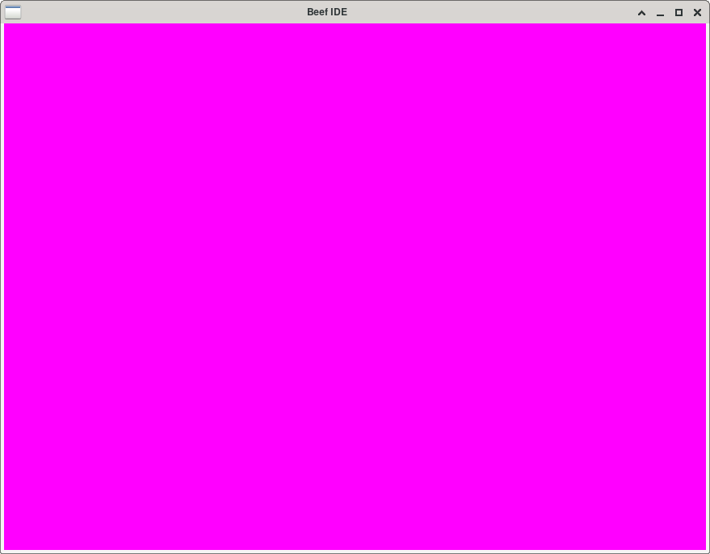

# Porting the Beef IDE to Linux

The Beef proramming language ships with an IDE, that is currently only supported on Windows.
It already
[contains](https://github.com/beefytech/Beef/tree/master/BeefySysLib/platform/sdl)
the basic facilities for a Linux/Mac port of the Beef IDE.
It is a SDL-based rendering backend for the UI.
This fork attempts to bring these existing facilities to life on Linux platforms

## Regression November 2022

The project still builds the C++ code but fails (for an unknown reason) when building the self-hosted components of the system:

```
$ xmake
Building: BeefBuild_boot
[******************************]
TIMING: Beef compiling: 65.4s
Comptime execution time: 0.45s
Linking IDE/dist/BeefBuild_boot...
SUCCESS
Building: BeefBuild
[******************************]
Beef compilation time: 27.31s
Comptime execution time: 0.21s
Executing Command: ReadFile("$(WorkspaceDir)/../IDE/dist/IDEHelper_libs.txt", "IDEHelperLibs")
error: execv(IDE/dist/BeefBuild_boot -proddir=BeefBuild -config=Release) failed(-1)
```

## Build on Arch Linux

Prerequisites:

* Install xmake from AUR: https://aur.archlinux.org/packages/xmake

```
sudo pacman --sync --needed llvm13 clang noto-fonts sdl2 freetype2 libglvnd
git clone --branch xmake https://github.com/flying-dude/Beef
cd Beef
xmake build libffi
xmake
./IDE/dist/BeefIDE
```

This is work in progress.
Currently you can compile the IDE and display the main SDL window of the IDE.

Here is how it looks right now:



